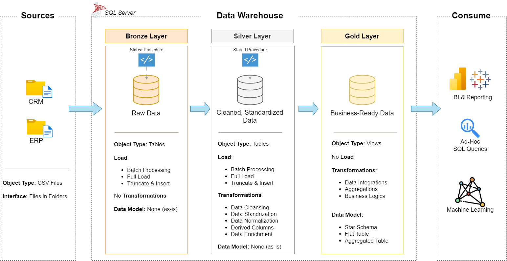
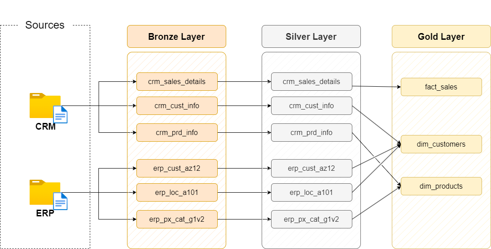
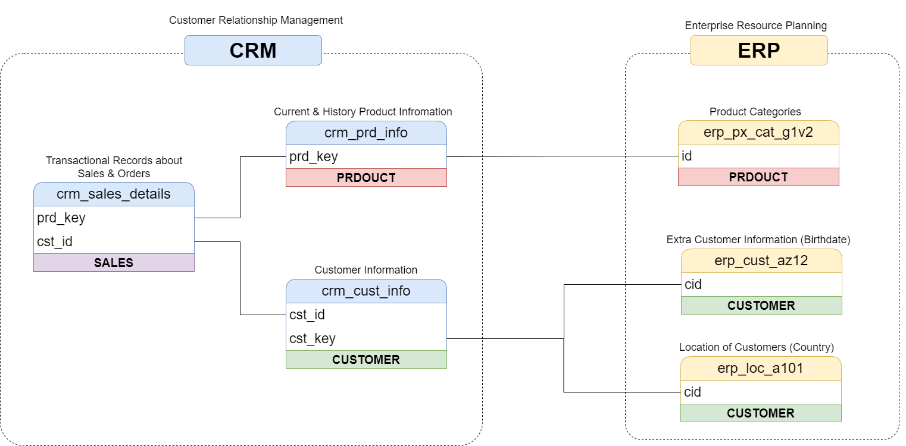
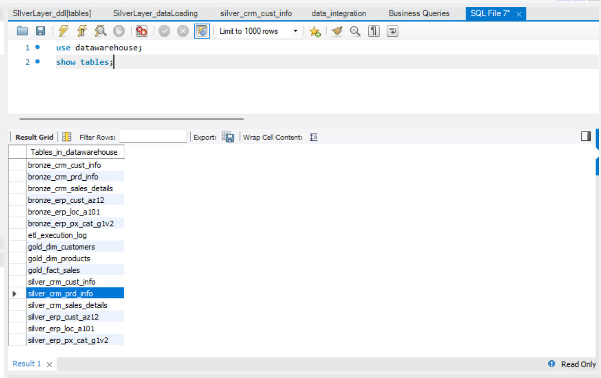
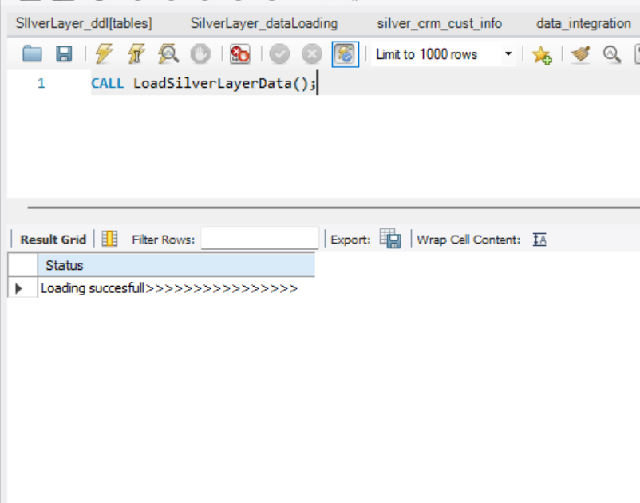
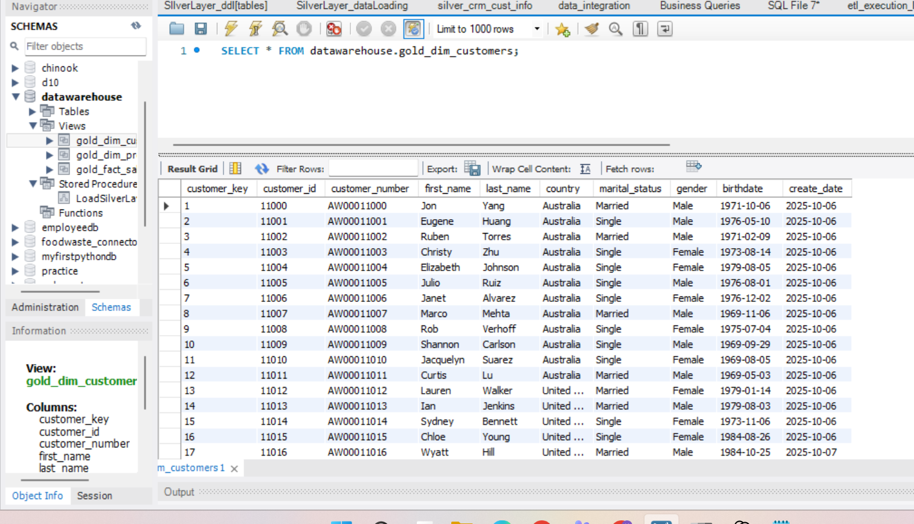
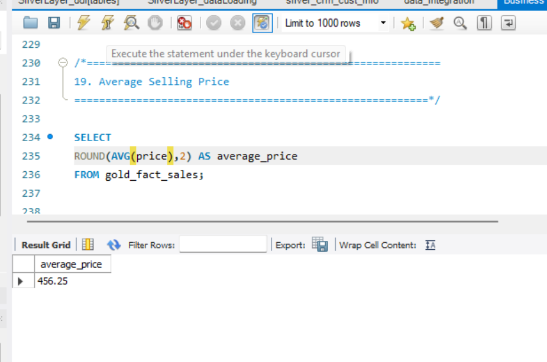
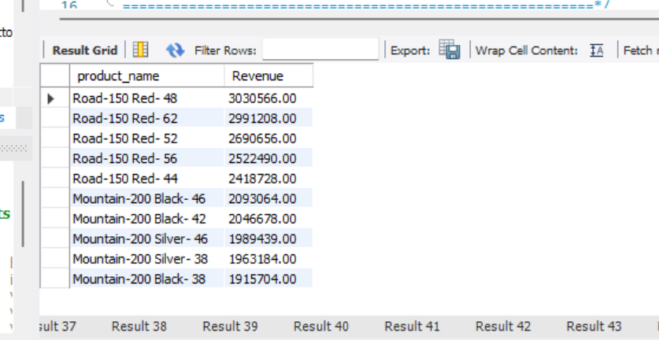
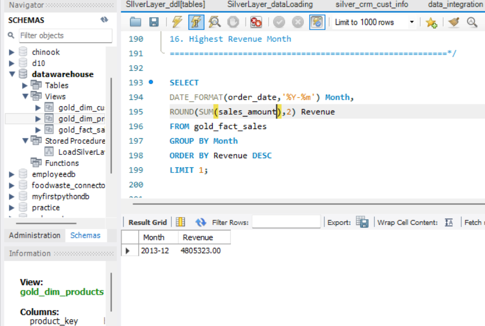

# 🚀 SQL Data Warehouse Project | MySQL | Medallion Architecture

An end-to-end SQL Data Warehouse project built using **MySQL Workbench** that demonstrates the complete data engineering workflow—from ingesting raw CRM and ERP data to transforming it into a business-ready analytical model using the **Medallion Architecture (Bronze → Silver → Gold)**.

This project showcases data ingestion, ETL development, data cleaning, transformation, dimensional modeling, and business analytics using MySQL.

---

# 📌 Project Overview

The objective of this project is to build a modern SQL Data Warehouse capable of integrating data from multiple source systems and transforming it into a business-ready analytical model.

The project follows the **Medallion Architecture**, consisting of three layers:

- 🥉 Bronze Layer – Raw data ingestion from source CSV files.
- 🥈 Silver Layer – Data cleansing, standardization, and transformation.
- 🥇 Gold Layer – Business-ready analytical views following a Star Schema.

---

# 🏗️ Data Architecture



---

# 🔄 Data Flow



---

# 🔗 Data Integration



---

# ⭐ Star Schema


---

# 🏛️ Medallion Architecture

```
               CSV Files
                   │
                   ▼
            Bronze Layer
          (Raw Source Data)
                   │
                   ▼
            Silver Layer
    (Cleaned & Standardized Data)
                   │
                   ▼
             Gold Layer
     (Business Ready Views)
                   │
                   ▼
          Business Analytics
```

---

# 🛠️ Technologies Used

- MySQL Workbench
- SQL
- Stored Procedures
- Views
- ETL Pipeline
- Data Warehousing
- Star Schema
- Git
- GitHub

---

# 📂 Project Structure

```
mysql-data-warehouse-project/
│
├── datasets/
├── Docs/
├── Results/
├── Screenshots/
├── Scripts/
│   ├── 01_database/
│   ├── 02_bronze/
│   ├── 03_silver/
│   ├── 04_gold/
│   └── 05_analysis/
│
├── tests/
│
├── README.md
├── LICENSE
└── .gitignore
```

---

# 📊 Dataset

The project integrates data from two business systems.

### CRM Source

- Customer Information
- Product Information
- Sales Transactions

### ERP Source

- Customer Demographics
- Customer Location
- Product Categories

---

# 🥉 Bronze Layer

The Bronze layer stores raw data exactly as received from the source systems.

### Key Activities

- Raw table creation
- CSV data loading
- Source data preservation
- Batch loading

Scripts:

```
Scripts/02_bronze/
```

- Bronze Layer Tables.sql
- DataLoading.sql

---

# 🥈 Silver Layer

The Silver layer cleans and transforms the raw data into standardized datasets.

### Data Cleaning

- Removed duplicate records
- Standardized gender values
- Standardized marital status
- Converted date formats
- Removed invalid values
- Data validation
- Data quality checks

Scripts:

```
Scripts/03_silver/
```

- SIlverLayer_ddl[tables].sql
- SilverLayer_dataLoading.sql

---

# 🥇 Gold Layer

The Gold layer contains analytical views built using a Star Schema.

Views:

- gold_dim_customers
- gold_dim_products
- gold_fact_sales

Script:

```
Scripts/04_gold/
```

- data_integration.sql

---

# 📈 Business Analysis

The Gold layer supports business reporting through analytical SQL queries.

Examples include:

- Total Revenue
- Total Orders
- Monthly Revenue Trend
- Top Customers
- Top Products
- Revenue by Category
- Revenue by Country
- Highest Revenue Month
- Best Performing Category
- Average Selling Price

Location:

```
Scripts/05_analysis/business_queries.sql
```

---

# ✅ Data Validation

Validation scripts verify the quality and consistency of the warehouse.

Validation includes:

- Duplicate record checks
- NULL value checks
- Invalid date detection
- Record count validation
- Business rule validation

Location:

```
tests/
```

---

# 📷 Project Screenshots

## Database Schema



---

## Bronze Layer Loading History


---

## Silver Layer Loading



---

## Views and Stored Procedures


---

## Customer Dimension



---

# 📊 Sample Results

## Average Selling Price



---

## Best Performing Category


---

## Business Query Output



---

## Highest Revenue Month



---

## Revenue by Marital Status


---

# ▶️ How to Run

1. Clone the repository

```bash
git clone https://github.com/MaramVijayreddy/SQL-DataWareHouse_Project.git
```

2. Open **MySQL Workbench**.

3. Execute the SQL scripts in the following order:

```
1. Create Database

2. Bronze Layer Tables.sql

3. DataLoading.sql

4. SIlverLayer_ddl[tables].sql

5. SilverLayer_dataLoading.sql

6. data_integration.sql

7. business_queries.sql
```

---

# 📌 Key Features

- End-to-End ETL Pipeline
- Bronze → Silver → Gold Architecture
- Data Cleaning & Transformation
- Star Schema Design
- Stored Procedures
- Analytical SQL Views
- Business Analysis Queries
- Data Validation
- Production-style SQL Project Structure

---

# 🚀 Future Improvements

- Power BI Dashboard Integration
- Automated ETL Scheduling
- Incremental Data Loading
- Cloud Data Warehouse Deployment
- Performance Optimization
- Data Quality Monitoring

---

# 👨‍💻 Author

**Maram VijayReddy**

- GitHub: https://github.com/MaramVijayreddy
- LinkedIn: https://www.linkedin.com/in/maram-vijay-reddy/

---

# ⭐ If you found this project useful

If you found this project helpful or learned something from it, consider giving it a ⭐ on GitHub. It helps others discover the project and motivates future improvements.
